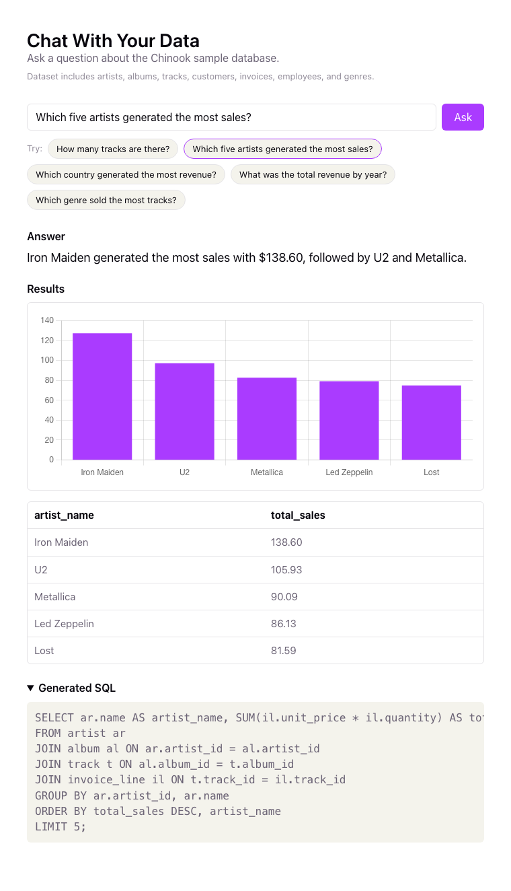

# Chat With Your Data

Live demo: https://chat-with-your-data-frontend.onrender.com  
GitHub repo: https://github.com/KartikDogra02/chat-with-your-data

Ask a plain-English question about a database and get back a grounded answer,
the SQL that produced it, and a chart when the result is chartable. Built on
the [Chinook](https://github.com/lerocha/chinook-database) sample music store
dataset.

> "Which five artists generated the most sales?" → a one-sentence answer, a
> bar chart, the result table, and the generated SQL.

## Screenshot



## Try it

Example questions:

- How many tracks are there?
- Which five artists generated the most sales?
- Which country generated the most revenue?
- What was the total revenue by year?
- Which genre sold the most tracks?

## Stack

- **Backend:** FastAPI + OpenAI (structured output) + PostgreSQL (psycopg3)
- **Frontend:** Vue 3 + Vite + Chart.js
- **SQL safety:** [`sqlglot`](https://github.com/tobymao/sqlglot)-based validation, a read-only DB user, read-only transactions, statement timeouts, row limits
- **Packaging:** Docker Compose (local Postgres), Render (deploy)

## Run it locally

```bash
docker compose up -d
cd backend
uv run uvicorn backend.main:app --reload
```

In a second terminal:

```bash
cd frontend
npm run dev
```

Then open:

- **Frontend:** <http://localhost:5173>
- **Backend docs:** <http://localhost:8000/docs>

First time setup (dependency install, `.env` files) is covered in
[`backend/README.md`](backend/README.md) and
[`frontend/README.md`](frontend/README.md).

## Live deployment

The app is deployed on Render:

- **Frontend:** <https://chat-with-your-data-frontend.onrender.com>
- **Backend API:** <https://chat-with-your-data-backend.onrender.com>
- **Backend docs:** <https://chat-with-your-data-backend.onrender.com/docs>
- **Database:** Render managed PostgreSQL seeded with the Chinook dataset

Deployment is described by [`render.yaml`](render.yaml), a Render Blueprint
that provisions the managed Postgres database, the FastAPI backend, and the
Vue static frontend together.

The production setup uses:

- `OPENAI_API_KEY` as a backend secret
- `CORS_ORIGINS` so the deployed frontend can call the backend
- `VITE_API_BASE_URL` so the deployed frontend points at the deployed API
- `database/seed.sql` for managed Postgres seeding

`database/seed.sql` exists because the original local Docker script,
`database/init/chinook.sql`, starts with `DROP DATABASE`, `CREATE DATABASE`,
and `\c chinook`, which managed Postgres users generally cannot run.

## How it works

1. The backend fetches the live database schema and sends it, plus the
   question, to the LLM with a structured-output schema
   (`{can_answer, sql, reason}`). If `can_answer` is false it returns the
   reason and stops — no database access.
2. Otherwise the SQL is validated, executed against a read-only Postgres
   connection, and the resulting rows are fed back to the LLM to produce a
   plain-English answer.
3. The frontend renders the answer, a bar chart (when the result is exactly
   one category column + one numeric column), the result table, and the
   generated SQL in a collapsed `<details>`.

See [`backend/src/backend/pipeline.py`](backend/src/backend/pipeline.py) for
the full request flow.

## Safety guardrails

The model's SQL is untrusted input. Before anything touches the database,
[`sql_validator.py`](backend/src/backend/sql_validator.py) parses it with
`sqlglot` and rejects it unless:

- it is exactly one statement, and that statement is a `SELECT`,
- no write expression (`INSERT`/`UPDATE`/`DELETE`/`DROP`/`ALTER`/`CREATE`/...)
  appears anywhere in the tree — including hidden inside a CTE,
- it doesn't use `SELECT INTO`, row-locking clauses, or a handful of
  resource-affecting Postgres functions (`pg_sleep`, `pg_read_file`, ...).

The validator then rewrites the query with a hard `LIMIT 100` if one isn't
already present (or lowers an oversized one). On top of that, the database
connection itself runs in `SET TRANSACTION READ ONLY` with a 5-second
statement timeout, against a Postgres role that only has read grants — so
even a bug in the validator can't turn into a write.

## Self-correction loop

When the validated SQL fails to *execute* (wrong table/column name, type
mismatch, etc.), the backend gets exactly one shot at fixing it: the failed
SQL and the raw database error are sent back to the model through a
dedicated `fix_sql` prompt, and the corrected query is validated and run
again from scratch. If that also fails, the error is raised rather than
retried again — no unbounded loop.

Validation failures are handled differently and are *never* retried: if the
SQL is unsafe, that's a bug in generation, not something worth asking the
model to "fix" with another guess.

The `/ask` response includes `attempts` and `corrected` so you can see when
this kicked in.

## Refusing impossible questions

The model returns a structured decision, not just SQL: `{can_answer, sql,
reason}`. If a question asks for data the Chinook schema doesn't have —
refunds, churn, signups, sales quotas, profit margin — it sets
`can_answer: false` with a one-sentence reason, and the pipeline returns that
without ever touching the database (`refused: true` in the response). This is
what stops the model from hallucinating a plausible-looking query against
columns that don't exist. The eval set below measures how well it holds.

## Observability

The backend emits one structured JSON log line per `/ask` request with a
request ID, model, latency, token usage, estimated cost, `schema_hash`, and the
refusal/correction flags — plus an `error_type` line on failures. Raw questions
are not logged: only a short preview (first 120 chars) and a SHA-256 hash are
kept, enough to correlate and debug without retaining user text wholesale.
Latency, token usage, and cost are request-level totals across all model calls
made while answering the question (SQL generation, optional SQL correction, and
plain-English answer generation).

```json
{"event": "question_answered", "request_id": "5e5e63f7c9f2", "model": "gpt-4.1-mini",
 "schema_hash": "91385299c9ea", "refused": false, "attempts": 1, "corrected": false,
 "latency_ms": 3966.0, "input_tokens": 1411, "output_tokens": 34, "cost_usd": 0.0006188,
 "question_preview": "Which five artists generated the most sales?",
 "question_hash": "0c174f5972d0f5fdca1d0e97b9ec4b071b60eb6723aa62f8d81627e27d6c0d7e"}
```

Failure logs use the same request ID/fingerprint shape and include the
exception class. They currently do not include partial latency/token totals,
because errors are handled at the FastAPI boundary after the pipeline raises.

```json
{"event": "question_failed", "request_id": "a31f2e9208dd",
 "error_type": "QueryExecutionError",
 "question_preview": "Which customers churned last month?",
 "question_hash": "db8f2f3a43d72ec2d6bff2d21c7c60fb43f9d9fb0225ce1d9a188ad1d08e1a35"}
```

`schema_hash` is a 12-char fingerprint of the exact schema text sent to the
model, so a request can be tied back to the prompt context it ran against.

## Evals

### Methodology

[`evals/questions.json`](evals/questions.json) has 17 questions in three
categories:

- **`should_pass` (10)** — answerable questions with an exact expected result.
  These pass on a strict row-by-row comparison (numbers compared with a small
  float tolerance for Postgres `Decimal` aggregates).
- **`should_fail` (5)** — questions the Chinook schema *can't* answer (refund
  rate, churn, signups, sales quota, profit margin). These pass only if the
  system refuses (`refused: true`) instead of inventing SQL.
- **`ambiguous` (2)** — answerable but under-specified ("who are the best
  customers?"). These pass if the system produces *an* answer at all.

Run them (needs a seeded DB and `OPENAI_API_KEY`):

```bash
cd backend
uv run python -m backend.eval_runner --model gpt-4.1-mini          # exact-row + refusal
uv run python -m backend.eval_runner --model gpt-4o-mini --judge   # + prose judge
```

The runner reports per-question latency, token usage, and estimated cost, plus
aggregate p50/p95 latency and average cost. With `--judge` it adds a second,
independent signal: an LLM-as-judge ([`judge.py`](backend/src/backend/judge.py))
reads the returned rows and the prose answer and decides whether the answer
faithfully reflects the data. Exact-row match asks "did the SQL return the
right data"; the judge asks "did the sentence describe it honestly" — they can
disagree, which is the point.

### Model comparison

Same 17 questions, snapshot on `2026-07` (models are non-deterministic — treat
as a snapshot, not a guarantee):

| Model | should_pass | should_fail | ambiguous | Prose judge | p50 latency | p95 latency | Avg cost/query |
|---|---:|---:|---:|---:|---:|---:|---:|
| `gpt-4.1-mini` | 10/10 | 5/5 | 1/2 | 9/11 | 3.7s | 14.1s | ~$0.00076 |
| `gpt-4o-mini`  | 9/10  | 5/5 | 1/2 | 7/11 | 3.3s | 5.7s  | ~$0.00030 |

The tradeoff: `gpt-4o-mini` is ~2.5× cheaper and tighter on tail latency, but
it dropped to 9/10 on exact-row accuracy and its prose was judged faithful less
often. Both models refuse impossible questions perfectly (5/5) — the guardrail
doesn't depend on the bigger model. `gpt-4.1-mini` is the default; `gpt-4o-mini`
is a reasonable cost-down if the occasional wrong column is acceptable.

(Costs use OpenAI's published per-token prices — see
[`pricing.py`](backend/src/backend/pricing.py) — and are estimates, not billing.)

### Known failure cases

- **Ambiguous questions skew toward refusal.** Both models refused "Who are the
  best customers?" (best by spend? by invoice count?) rather than pick an
  interpretation. That's the refusal prompt erring on the cautious side;
  loosening it would risk hallucinating on genuinely impossible questions, so
  1/2 here is a deliberate tension, not a pure bug.
- **`gpt-4o-mini` dropped a column.** On "what is the longest track and who is
  its artist?" it returned track + artist but omitted the `milliseconds` value.
  Exact-row match caught it; the prose judge *passed* it — exactly the kind of
  disagreement that justifies keeping both signals.
- **Judge is stricter than row-match.** Even with correct rows, the judge
  sometimes fails answers that summarize a ranking ("top 5 … followed by …")
  without restating every figure. It's a rough signal, not ground truth.
- **Small-n latency is noisy.** p95 over 17 questions is dominated by a single
  outlier (one `gpt-4.1-mini` call took ~13s), which is why its p95 looks far
  worse than `gpt-4o-mini`'s despite similar medians.

## Limitations

- Multi-step questions ("compare this quarter to last, excluding refunds")
  aren't handled; ambiguous ones are tested but currently lean toward refusal.
- No conversation memory — every question is independent, so follow-ups like
  "now break that down by month" don't have context from the previous answer.
- The chart logic is a simple frontend heuristic (exactly 2 columns, second
  one numeric) rather than something the model decides, so a chartable
  3-column result won't get a chart.
- One dataset (Chinook). Nothing here is general-purpose "talk to any
  database."

## What I'd improve next

- Tool calling instead of structured-output string parsing for SQL
  generation — the more standard way real agentic systems call out to tools.
- Schema retrieval (RAG) so a much larger schema doesn't have to be sent in
  full on every request.
- Let the model choose the chart type instead of a fixed frontend rule.
- Tune the refusal/ambiguity boundary so genuinely answerable-but-vague
  questions get a reasonable default instead of a refusal.
- Grow the eval set and wire the manual `evals.yml` workflow into a
  pre-release gate once the cost/secret story is worked out.
